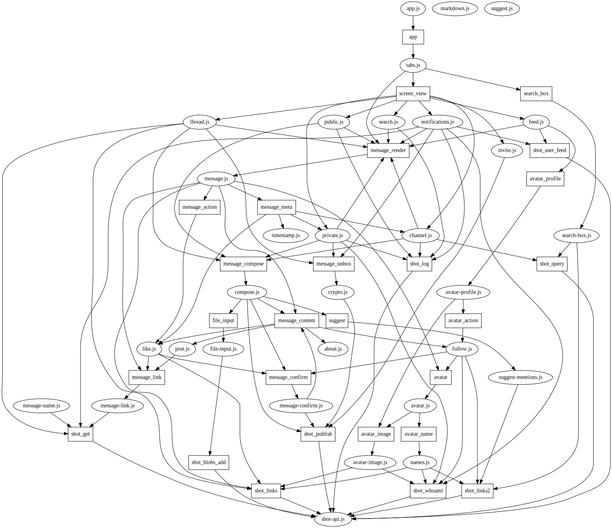

# patchbay

Prototype of a pluggable patchwork.

Patchbay uses [depject](https://npm.im/depject) to provide
a highly composable api. all scripts in the `./modules` directory
are loaded and combined using [depject](https://npm.im/depject)

This makes in very easy to create say, a renderer for a new message type,
or switch to a different method for choosing user names.

Currently, this is a proof of concept, there is a basic way to switch
between tabs, and you can view the main log, user feeds, or threads.
This should obviously be improved with a module that can
scroll properly scoll through a feed.

No "write" methods have been implemented yet.

## overview

Currently, the main module is `tabs.js` which plugs into
the `app` socket, and provides the `screen_view` socket.
when you click a link, `screen_view` socket with the link path,
which returns a html element which becomes a new tab.

currently, `main.js` `feed.js` and `thread.js` plug into `screen_view`
and then in turn, call the `message_render` socket, which calls
`message_content` `avatar` `message_meta` `message_action` and `message_link`.

`avatar.js` plugs into `avatar`, and provides the `avatar_name` socket.
it just returns a link to the public key, labled with what it gets back
from `avatar_name` socket. this is in turn provided by the `names.js` module.

Two modules plug into `message_content`, `post.js` and `like.js`

No plugs into the `message_action` socket have been implemented yet,
but whatever is returned from this will inserted into the dom at the bottom
of the message (by the `message` module) so this would be the plug to
use for implementing a like/+1/fav/dig/yup button, or a reply button.

## other ideas

Editable messages would probably need to plug into several sockets.
firstly they would render content differently, so probably use the `message_content` socket.
secondly they would need to show edit state, which would probably use `message_meta`
and finially they'd need to provide the ability to edit the message!
that would use `message_action`

Implementing a "events" message type would be easy, just implement another
plug for `message_content`, that renders events.

Instead of reading all the modules in a directory, it would be better
to load these from configuration. Then, modules could be distributed
as browserify bundles, and distributed over ssb. Configuration
could just be a list of hashes - but you could also disable specific
sockets or plugs if necessary (leaving them unconnected).

Then, that configuration could be shared over ssb!

## Running

```
npm install scuttlebot@latest -g
# make sure you have secure-scuttlebutt@15.2.0
npm ls secure-scuttlebutt -g
sbot server
# OR, install and run patchwork. (must have at least >= 2.8)

# then in another tab (these must be two separate commands)
sbot plugins.install ssb-links
sbot plugins.install ssb-query
# restart sbot server (go back to previous tab and kill it)
```
now clone and run patchboard.
```
git clone https://github.com/dominictarr/patchbay.git
cd patchbay
npm install electro electron-prebuilt -g
# for node@6, you'll currently need to use js crypto.
CHLORIDE_JS=1 electro index.js

# otherwise
electro index.js
```

## modules

patchbay uses [depject](http://github.com/dominictarr/depject) to manage it's modules.
here is a graph of the current connections between them. (round shows module,
square shows api, arrow direction points from user to provider)




## License

MIT


